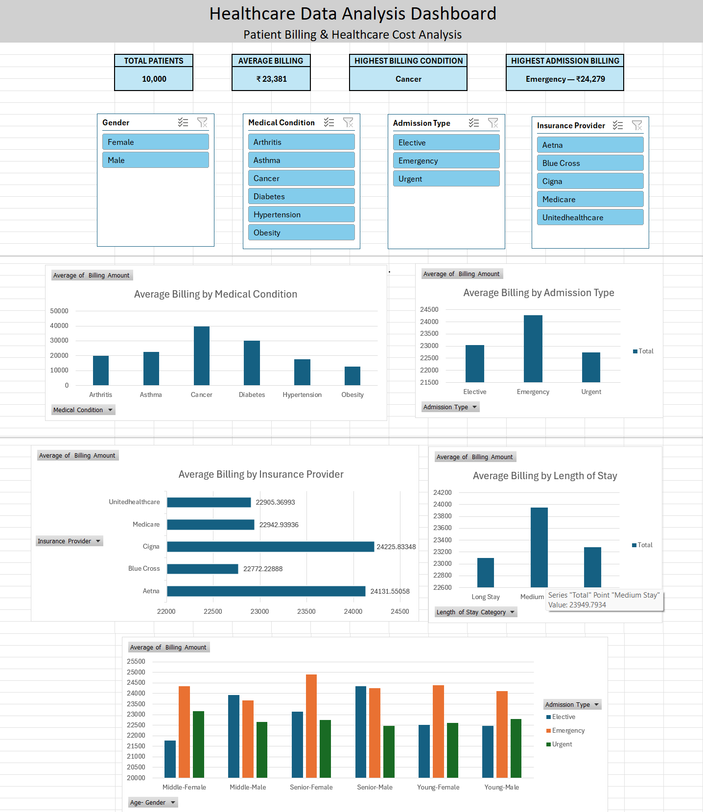

# Healthcare Data Analysis Dashboard

## Project Overview

This project analyzes a 10,000-record healthcare dataset to understand patient demographics, hospital admissions, treatment duration, billing, medical conditions, insurance providers, and test outcomes.

The project was created as part of my Data Analyst learning journey and demonstrates practical skills in:

- Excel data cleaning and transformation
- Exploratory Data Analysis (EDA)
- Pivot Tables and Pivot Charts
- KPI development
- Dashboard design
- Business-oriented insight generation
- Healthcare data analysis

## Business Objective

The objective is to turn raw healthcare records into meaningful insights that can help answer questions such as:

- How much total billing is generated?
- Which admission types contribute most to billing?
- How does billing vary by gender and medical condition?
- Which age groups account for the most patients?
- What are the patterns in treatment duration?
- How do test results vary across patient groups?
- Which insurance providers are associated with higher billing?
- Where are potential high-billing or high-cost segments?

## Project Structure

```text
healthcare-data-analysis/
|
|-- Healthcare_Data_Analysis.xlsx
|-- PROJECT_NOTES.md
|-- README.md
|-- .gitignore
```

## Dataset

The cleaned dataset contains **10,000 healthcare records** and 23 analytical columns.

Key fields include:

- Patient demographics
- Age and age buckets
- Gender
- Blood type
- Medical condition
- Date of admission
- Hospital and doctor
- Insurance provider
- Billing amount
- Admission type
- Discharge date
- Medication
- Test results
- Treatment days
- Billing per day
- Length-of-stay category
- Billing amount and billing-per-day buckets

## Data Preparation

The dataset was prepared for analysis by creating analytical fields such as:

- Age Bucket
- Age-Gender
- Treatment Days
- Year of Admission
- Billing per Day
- Length of Stay Category
- Billing Amount Bucket
- Billing per Day Bucket

These derived fields support segmentation, KPI analysis, and dashboard creation.

## Dashboard Preview



## Analysis

The analysis focuses on:

### Patient Demographics
- Total patients
- Gender distribution
- Age-group distribution
- Blood-type distribution

### Hospital & Admission Analysis
- Admission type
- Hospital activity
- Treatment duration
- Length-of-stay categories

### Financial Analysis
- Total billing
- Billing by gender
- Billing by admission type
- Billing by medical condition
- Billing per day
- High/medium/low billing segments

### Clinical Analysis
- Medical conditions
- Test results
- Medication usage
- Abnormal/inconclusive test-result patterns

## Key Insights

**The completed analysis is designed to highlight:**

	- Emergency admissions have the highest average billing, at approximately ₹24,279, compared with the overall average of ₹23,381.
	- Cancer is the highest-billing medical condition, with an average billing of approximately ₹39,677, around 70% above the overall average.
	- Medical condition appears to be a stronger differentiator of billing than insurance provider or demographic segment. Cancer remains the highest-billing condition across all insurance providers and age-gender groups.
	- Insurance providers show relatively small differences in average billing, with Cigna recording the highest average at approximately ₹24,226 and Blue Cross the lowest at ₹22,772.
	- Length of stay alone does not strongly differentiate average billing. Average billing remains relatively consistent across Short, Medium, and Long Stay categories.
	- Emergency admissions consistently show higher average billing across length-of-stay categories, with Medium Stay + Emergency cases recording the highest combination at approximately ₹24,659.

## Business Recommendations

  	**Based on the analysis, the following areas could be explored further:**
    
		- Investigate high-cost medical conditions
Analyze Cancer and Diabetes cases in greater detail to understand treatment intensity, resource utilization, and factors contributing to higher billing.
		- Monitor emergency-care utilization
Emergency admissions consistently show higher average billing. Further analysis of treatment types, length of stay, and resource utilization could help identify cost drivers.
		- Analyze cost drivers beyond length of stay
Since billing remains relatively consistent across stay categories, healthcare costs should be evaluated using additional factors such as medical condition, admission type, and patient characteristics.
		- Perform deeper segment analysis
Combine medical condition, admission type, demographics, and insurance information to identify high-cost patient segments and support better resource planning.


## Tools Used

- **Microsoft Excel**
- **PivotTables & PivotCharts**
- **Power Query**
- **GitHub**

## What I Learned

This project helped me practice the complete analyst workflow:

**Raw Data -- Data Cleaning -- Feature Creation -- EDA -- KPI Analysis -- Visualization -- Business Insights**

It also helped me move beyond simply creating charts toward asking:

> **"What business or operational decision does this analysis support?"**

## Future Improvements

- Add Power BI dashboard screenshots
- Add the Power BI `.pbix` project file where appropriate
- Add SQL analysis based on the same dataset
- Add a detailed data dictionary
- Add deeper healthcare cost and patient-segment analysis

## Author

**Pankhuri**

Aspiring Data Analyst | Excel | Power BI | SQL | Python | Data Analytics
